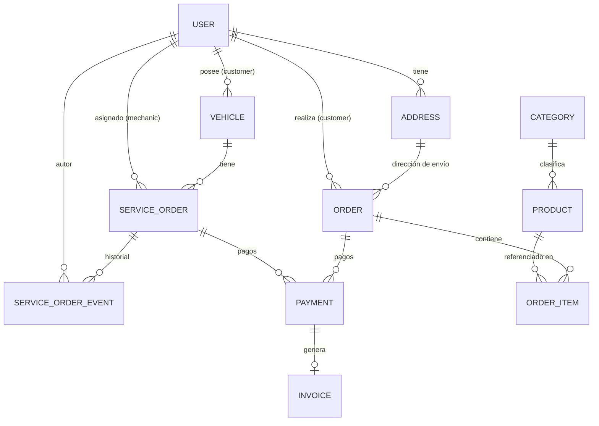

# Modelo de datos

Modelo detallado de entidades y relaciones, basado en el alcance definido en `docs/01-requerimientos-y-arquitectura.md` y las historias de usuario en `docs/PRODUCT/historias-usuario/`.

Convenciones:
- Todo `id` es UUID.
- Todo timestamp usa zona horaria UTC en almacenamiento (se muestra en hora de Bogotá en UI).
- Los campos marcados `simulado` corresponden al alcance de demo descrito en la sección 0 de `docs/01-requerimientos-y-arquitectura.md`.
- Nombres de campo en `snake_case` en este documento (convención de columnas SQL); los contratos en `docs/CONTRACTS-API/` exponen los mismos campos en `camelCase` (convención JSON/JS) — es solo una diferencia de capa, no dos modelos distintos.

## Diagrama de entidades

> Nota: `PAYMENT` se relaciona con `ORDER` **o** con `SERVICE_ORDER`, nunca ambos a la vez (ver detalle en la entidad).

## Entidades

### User
| Campo | Tipo | Notas |
|---|---|---|
| id | UUID | PK |
| name | string | |
| email | string | único |
| password_hash | string | nunca se expone |
| phone | string | |
| role | enum(`customer`, `mechanic`, `admin`) | `mechanic`/`admin` solo se crean desde el panel (HU-01.3) |
| active | boolean | permite desactivar mecánicos sin borrar historial |
| created_at / updated_at | timestamp | |

### Vehicle
| Campo | Tipo | Notas |
|---|---|---|
| id | UUID | PK |
| owner_id | UUID | FK → User (rol customer) |
| brand | string | |
| model | string | |
| year | int | |
| plate | string | única dentro del `owner_id` (HU-03.1) |
| vin | string | opcional |
| created_at | timestamp | |

### ServiceOrder
| Campo | Tipo | Notas |
|---|---|---|
| id | UUID | PK |
| vehicle_id | UUID | FK → Vehicle |
| customer_id | UUID | FK → User; debe coincidir con `vehicle.owner_id` |
| mechanic_id | UUID | FK → User (rol mechanic), nullable hasta asignar |
| status | enum | `received`, `diagnosing`, `quote_sent`, `approved`, `in_repair`, `quality_check`, `ready_for_pickup`, `delivered` |
| problem_description | text | |
| estimated_cost | decimal | nullable hasta cargar cotización (HU-03.5) |
| final_cost | decimal | nullable |
| quote_status | enum(`pending`, `approved`, `rejected`) | nullable — sin valor hasta que se carga una cotización (HU-03.5); HU-03.6 |
| created_at / updated_at | timestamp | |

### ServiceOrderEvent
Historial inmutable (solo insert, nunca update/delete — ver HU-03.3).

| Campo | Tipo | Notas |
|---|---|---|
| id | UUID | PK |
| service_order_id | UUID | FK → ServiceOrder |
| status | enum | snapshot del estado en ese momento |
| note | text | opcional |
| photos | string[] | URLs, opcional |
| author_id | UUID | FK → User (mechanic o admin) |
| created_at | timestamp | |

### Product
| Campo | Tipo | Notas |
|---|---|---|
| id | UUID | PK |
| name | string | |
| description | text | |
| price | decimal | |
| stock | int | |
| category_id | UUID | FK → Category |
| images | string[] | URLs |
| active | boolean | desactivar sin perder historial en pedidos (HU-02.7) |
| created_at / updated_at | timestamp | |

### Category
| Campo | Tipo | Notas |
|---|---|---|
| id | UUID | PK |
| name | string | |

> Sin flag `active`: a diferencia de `Product`, una categoría no se "desactiva" — se renombra o deja de usarse (si no tiene productos activos, simplemente no aparece con ítems en el catálogo). Decisión de simplicidad para esta fase.

### Address
| Campo | Tipo | Notas |
|---|---|---|
| id | UUID | PK |
| user_id | UUID | FK → User |
| line1 | string | |
| city | string | |
| reference | string | opcional |
| created_at | timestamp | |

### Order (pedido de tienda)
| Campo | Tipo | Notas |
|---|---|---|
| id | UUID | PK |
| customer_id | UUID | FK → User |
| status | enum | `pending_payment`, `paid`, `preparing`, `ready_or_shipped`, `delivered`, `cancelled` |
| delivery_method | enum(`pickup`, `delivery`) | HU-02.4 |
| address_id | UUID | FK → Address, nullable si `pickup` |
| shipping_cost | decimal | tarifa fija, `simulado` |
| subtotal | decimal | |
| total | decimal | subtotal + shipping_cost |
| created_at / updated_at | timestamp | |

### OrderItem
| Campo | Tipo | Notas |
|---|---|---|
| id | UUID | PK |
| order_id | UUID | FK → Order |
| product_id | UUID | FK → Product |
| quantity | int | |
| unit_price | decimal | snapshot del precio al momento de compra (no se recalcula si el producto cambia de precio después) |

### Payment
Puede haber varios intentos de pago por `Order`/`ServiceOrder` (reintentos tras rechazo); solo uno queda `approved`.

| Campo | Tipo | Notas |
|---|---|---|
| id | UUID | PK |
| provider | enum(`mercadopago`) | modo sandbox en esta fase (HU-02.5, HU-03.7) |
| external_reference | string | id de pago en Mercado Pago |
| status | enum(`pending`, `approved`, `rejected`, `cancelled`) | |
| amount | decimal | |
| order_id | UUID | FK → Order, nullable |
| service_order_id | UUID | FK → ServiceOrder, nullable |
| created_at / updated_at | timestamp | **regla:** exactamente uno de `order_id` / `service_order_id` debe estar presente, nunca ambos ni ninguno |

### Invoice
Factura simulada (HU-05.1, HU-05.2, HU-05.3).

| Campo | Tipo | Notas |
|---|---|---|
| id | UUID | PK |
| payment_id | UUID | FK → Payment, único (1 factura por pago aprobado) |
| number | string | consecutivo único |
| series | enum(`store`, `service`) | permite series separadas si se requiere (a confirmar) |
| provider | string | `"simulado"` en esta fase; nombre del proveedor DIAN real en fase futura |
| cufe | string | nullable, solo aplica con proveedor DIAN real |
| pdf_url | string | |
| status | enum(`issued`, `voided`) | |
| issued_at | timestamp | |

## Reglas de negocio clave a nivel de datos

1. Un `ServiceOrderEvent` nunca se edita ni se borra — solo se agregan nuevos (auditoría, ver `docs/01-requerimientos-y-arquitectura.md` sección 6).
2. `Payment.order_id` y `Payment.service_order_id` son mutuamente excluyentes (constraint a nivel de aplicación y, si el motor lo permite, `CHECK` en base de datos).
3. `Invoice` solo se genera cuando un `Payment` pasa a `approved` (HU-05.1 / HU-05.2).
4. Un `mechanic` solo puede escribir `ServiceOrderEvent` en `ServiceOrder` donde `mechanic_id` sea su propio `User.id` (HU-03.3, HU-03.8) — se aplica a nivel de autorización, no de esquema, pero condiciona las queries permitidas.
5. `Vehicle.plate` es única por `owner_id`, no globalmente (simplificación para esta fase de demo).
6. `ServiceOrder.status` puede avanzar independientemente del estado de `Payment` — el pago no bloquea el inicio ni avance de la reparación (ver `docs/ADR/0005-inicio-de-reparacion-no-bloqueado-por-pago.md`).
7. Los endpoints de cotización (cargar/aprobar/rechazar) y de pago generan también un `ServiceOrderEvent`, no solo `POST /api/service-orders/:id/events` — así el timeline (HU-03.4) queda completo (ver `docs/CONTRACTS-API/ordenes-servicio.md`).

## Pendiente de definir
- ¿`Invoice.series` separa numeración de tienda vs. servicio, o comparten un solo consecutivo? (ver nota en HU-05.2).
- Proveedor de almacenamiento de archivos (Supabase Storage vs. Cloudinary) para las imágenes de producto y fotos de servicio (ver `docs/CONTRACTS-API/archivos.md`).
